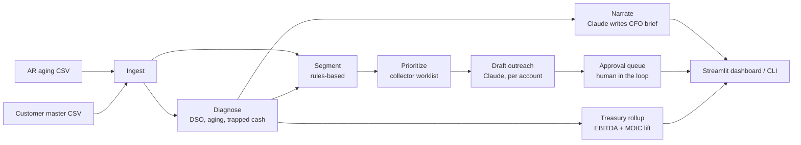

# Working Capital Agent

**An agentic AI that runs the accounts-receivable diagnostic and collections
workflow a turnaround consultant is hired to do — in seconds, not weeks, and
re-runnable across an entire portfolio.**

Point it at an AR aging file. It returns a CFO-grade diagnostic of where cash
is trapped, sizes the recoverable opportunity, segments the customer book, and
drafts the week's collection outreach — one tone-matched email per account.

> Built as a portfolio-company value-creation pilot. All data in this repo is
> synthetic; the figures are illustrative but the logic is production-grade.

---

## Why this exists

Slow receivables are the most common, most fixable cash problem in a
private-equity portfolio. Every dollar tied up in DSO is a dollar of working
capital that could be paying down debt or funding growth, which is why a
working-capital workstream sits in nearly every PE 100-day plan.

Today that work is bought from consultants. A mid-market working-capital
diagnostic from a firm like Alvarez & Marsal, FTI, 
or a Big Four practice may be a **six-figure engagement that runs 6–12
weeks**, and it produces a point-in-time deck. Published working-capital
programs commonly target **DSO reductions in the 10–20% range**; this pilot is
built so the diagnostic walks a reader through exactly that logic.

The diagnostic itself is now automatable. The judgment-heavy parts — the
written CFO narrative and the customer-by-customer outreach — are exactly what
a large language model is good at. The arithmetic stays deterministic.

| | Working-capital consulting engagement | Working Capital Agent |
|---|---|---|
| Cost | Six figures (mid-market diagnostic) | API usage — single-digit dollars per run |
| Time to first output | 6–12 weeks | Under a minute |
| Cadence | One-off, point-in-time | Re-run on every aging refresh |
| Output | Diagnostic deck + recommendations | Diagnostic **+ ready-to-send outreach** |
| Portfolio coverage | One company per engagement | Same agent across every portco |

---

## What the agent does

**Act 1 — The Diagnostic.** The deliverable a working-capital consultant
builds by hand. Deterministic, auditable analytics: DSO vs. a realistic
target, the full aging curve, customer concentration, disputed exposure,
current AR likely to slip based on payer history, and a triangulated cash
opportunity (structural DSO improvement plus risk-adjusted near-term
collectible). Claude then writes the board-ready narrative.

**Act 2 — The Remediation Loop.** The agentic part. The A/R book is segmented
(Strategic / Standard / Chronic Late / High Risk) by rules, a priority-ranked
collector worklist is built from past-due dollars × age × segment risk, and
Claude drafts a tone-matched collection email for every account on the list —
warm for a strategic anchor, firm and escalatory for a 90-day account,
dispute-first where an invoice is contested.

Run it weekly against a fresh aging file and Act 2 becomes a standing
collections process, not a one-time report.

**The approval queue.** Every drafted email lands in a human-in-the-loop
review queue before it can go out. A reviewer approves, holds, edits or
rejects each one; nothing is sendable until a person signs off, and the send
step is gated on that approval. The agent does the work — the human keeps the
judgment and the send button.

**Act 3 — The Treasury Rollup.** One company is not a fund. The treasury view
re-runs the diagnostic across every portfolio company and rolls it into a
single value bridge. The working-capital improvement becomes a recurring
EBITDA lift — a disciplined, always-on collections process recovers disputed
and 90+ day receivables the status-quo process loses to write-off, and that
avoided bad-debt expense is recurring, above-the-line EBITDA. Valued at the
EV/EBITDA multiple each company was bought at, the lift becomes enterprise
value created; the one-time cash release deleverages 1:1. Together they roll
into an implied **MOIC lift** on the fund's invested equity.

---

## Architecture



Deterministic math (ingest, diagnose, segment, prioritize, and the entire
treasury rollup) is **never** delegated to the LLM, so every number is exact
and auditable. The LLM is used only where language and judgment are the point:
the narrative and the emails. All prompts are in
[`src/prompts.py`](src/prompts.py) — nothing is hidden.

---

## Illustrative results

Running the agent on the bundled synthetic portfolio (40 customers, 199 open
invoices, a deliberately realistic mix of payment behavior):

- **$5.62M** open AR against **$33.6M** TTM revenue — **DSO of 61 days**
- Realistic target DSO of **48 days** (weighted-average terms + 8-day buffer)
- Closing the 13-day gap is worth **~$1.19M** of structural cash release
- **$3.23M (57%)** of the book is past due; **~$3.04M** is realistically
  collectible near-term after risk adjustment
- **9 disputed invoices** ($0.15M) flagged as blocked cash
- A **10-account collector worklist** addressing **$1.97M** of past-due
  exposure, each with a drafted, tone-matched email

Rolled up across the seven-company demo fund — **Hadrian Capital Partners,
Fund III**, $196M of invested equity:

- **$16.1M** of trapped working capital identified across the portfolio
- A **$1.29M** run-rate EBITDA lift — **2.6%** of fund EBITDA — from recovering
  disputed and 90+ day receivables the status-quo process writes off
- At the entry multiples (**9.2x** blended), an implied **+0.13x MOIC lift**
  on the fund's invested equity (operating +0.05x, deleveraging +0.07x)

---

## Quickstart

```bash
pip install -r requirements.txt

python data/generate_data.py   # optional — CSVs are already committed
python run_demo.py             # full pipeline in the terminal
streamlit run app.py           # interactive dashboard
```

**Demo mode (default).** With no API key set, the agent runs end-to-end using
cached Claude responses in [`demo_cache/`](demo_cache/). No key, no network.

**Live mode.** Copy `.env.example` to `.env` and add an `ANTHROPIC_API_KEY`.
The agent then calls the Anthropic API to write the narrative and draft every
email live. Set `WCA_MODEL` to your preferred Claude model.

---

## Repo structure

```
working-capital-agent/
├── app.py                  Streamlit dashboard (Act 1, Act 2, Approval, Treasury)
├── run_demo.py             command-line runner
├── config.py               every tunable assumption, in one file
├── data/
│   ├── generate_data.py    seeded synthetic data generator
│   ├── ar_aging.csv         open-invoice aging snapshot (ERP-style export)
│   ├── customers.csv        customer master with payment history
│   ├── portfolio.csv        fund master — entry economics per portfolio company
│   └── portfolio/           per-company AR files for the rest of the fund
├── src/
│   ├── ingest.py           load + shape the data
│   ├── diagnostic.py       Act 1 — deterministic analytics
│   ├── remediation.py      Act 2 — segmentation + worklist
│   ├── approval.py         approval queue — human-in-the-loop review model
│   ├── treasury.py         Act 3 — fund rollup, EBITDA + MOIC lift
│   ├── prompts.py          all LLM prompts
│   ├── llm.py              Anthropic API + automatic demo-mode fallback
│   └── agent.py            orchestrates the full pipeline
└── demo_cache/responses.json   pre-generated Claude output for demo mode
```

---

## From pilot to a real portco

The two input CSVs deliberately mirror what any ERP exports: an open-invoice
AR aging report and a customer master. NetSuite, QuickBooks, Sage and
Dynamics all produce these in minutes. Pointing the agent at a real company is
a column-mapping exercise, not a re-build.

**Roadmap beyond this pilot:** direct ERP connectors, and the full cash
conversion cycle — accounts payable and inventory, not AR alone. The
human-in-the-loop approval queue and the fund-level treasury rollup, both once
on this list, now ship in the app.

---

## Disclaimer

All customers, invoices and figures in this repository are **synthetic**,
generated by `data/generate_data.py`. Nothing here represents a real company
or real receivables. The cash and DSO figures are illustrative and exist to
demonstrate the agent's logic. This tool supports a collections workflow; it
does not provide legal or financial advice.
